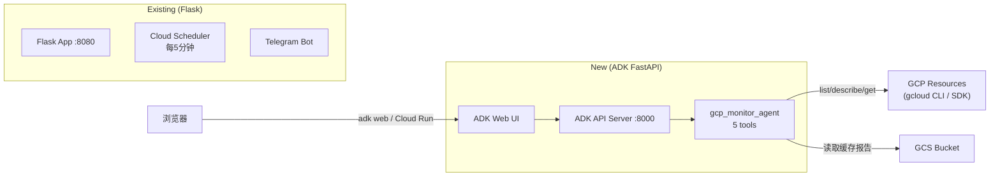

# ADK Web Chat Interface — Deployment & Usage Guide

## Overview

This document explains how to run, test, and deploy the ADK-based web chat interface
for GCP Monitoring Agent. The ADK service runs independently from the existing Flask app.

- **Flask app**: Scheduled inspections + Telegram notifications (existing)
- **ADK service**: Web-based chat interface for GCP resource queries (new)

## Architecture



## Local Development

### Prerequisites

```bash
# Activate virtual environment
source .venv/bin/activate

# Install dependencies
pip install -r requirements.txt -r requirements-adk.txt
```

### Method 1: `adk web` (Recommended)

The simplest way to test the agent. Run from the **project root** (parent of `agents/`):

```bash
adk web --port 8000
```

Then open **http://localhost:8000** in your browser.

Select **gcp_monitor_agent** from the agent dropdown and start chatting.

### Method 2: FastAPI + ADK Web (Dev Mode)

```bash
# Terminal 1: ADK API server
adk api_server --agents_dir=agents --allow_origins=http://localhost:4200

# Terminal 2: ADK Web UI (requires adk-web repo)
# cd adk-web && npm run serve --backend=http://localhost:8000
```

### Method 3: Uvicorn (Production-like)

```bash
# Start the FastAPI application directly
uvicorn main_adk:app --host 0.0.0.0 --port 8000 --reload

# Or override config via env vars
ADK_SERVE_WEB=true ADK_SESSION_URI="sqlite+aiosqlite:///./sessions.db" \
    uvicorn main_adk:app --host 0.0.0.0 --port 8000
```

### Quick Verification

```bash
# Health check
curl http://localhost:8000/health

# List available agents
curl http://localhost:8000/list-apps

# Send a test query (non-streaming)
curl -X POST http://localhost:8000/run_sse \
  -H "Content-Type: application/json" \
  -d '{
    "app_name": "gcp_monitor_agent",
    "user_id": "user_001",
    "session_id": "session_001",
    "new_message": {
      "role": "user",
      "parts": [{"text": "列出 us-central1-a 的所有 VM 实例"}]
    },
    "streaming": false
  }'
```

## Available Tools

| Tool | Description |
|------|-------------|
| `list_vm_instances` | 列出指定 zone 的所有 VM 实例及状态 |
| `get_vm_metrics` | 获取单个 VM 的实时 CPU/内存/磁盘指标 |
| `get_latest_report` | 获取最新的 GCP 巡检缓存报告 |
| `run_gcloud_query` | 执行安全的只读 gcloud 命令（实时数据） |
| `query_report` | 基于巡检报告用自然语言回答问题 |

## Example Conversation Starters

```text
- "现在有几台 VM 在运行？"
- "列出 us-central1-a 的所有实例"
- "查看 vm-1 的 CPU 使用率"
- "最新的巡检报告有什么异常吗？"
- "执行 gcloud compute instances list --format=json"
- "我的项目里有哪些 Cloud Run 服务？"
- "gcloud run services list --format=json"
- "帮我看看 vm-2 的内存使用情况"
```

## Cloud Run Deployment

### Option A: Manual gcloud Deployment

```bash
export PROJECT_ID="ai-hack-2026-winson"
export REGION="us-central1"
export SERVICE_NAME="gcp-monitor-adk"

# Build and deploy
gcloud builds submit --tag gcr.io/${PROJECT_ID}/${SERVICE_NAME} \
  -f Dockerfile.adk .

gcloud run deploy ${SERVICE_NAME} \
  --image gcr.io/${PROJECT_ID}/${SERVICE_NAME} \
  --region ${REGION} \
  --platform managed \
  --memory 512Mi \
  --cpu 1 \
  --concurrency 80 \
  --max-instances 3 \
  --timeout 300 \
  --set-env-vars="GOOGLE_CLOUD_PROJECT=${PROJECT_ID}" \
  --set-env-vars="GOOGLE_CLOUD_LOCATION=${REGION}" \
  --set-env-vars="GOOGLE_GENAI_USE_VERTEXAI=True" \
  --allow-unauthenticated

# Get the service URL
export ADK_URL=$(gcloud run services describe ${SERVICE_NAME} \
  --region ${REGION} --format 'value(status.url)')
echo "ADK Web URL: ${ADK_URL}"
```

### Option B: Using ADK CLI

```bash
# Deploy the agent directly via ADK CLI
# Note: This creates a separate Cloud Run service
adk deploy cloud_run \
  --project ${PROJECT_ID} \
  --region ${REGION} \
  --service_name gcp-monitor-adk \
  --app_name gcp_monitor_agent \
  --with_ui \
  agents/adk_agent
```

### Verification

```bash
# Health check
curl ${ADK_URL}/health

# List apps
curl ${ADK_URL}/list-apps

# Send a query
curl -X POST ${ADK_URL}/run_sse \
  -H "Content-Type: application/json" \
  -d '{
    "app_name": "gcp_monitor_agent",
    "user_id": "user_001",
    "session_id": "session_001",
    "new_message": {
      "role": "user",
      "parts": [{"text": "How many VMs are running?"}]
    },
    "streaming": false
  }'
```

## Environment Variables

| Variable | Default | Description |
|----------|---------|-------------|
| `PORT` | `8080` | HTTP port (Cloud Run sets this automatically) |
| `ADK_SESSION_URI` | `sqlite+aiosqlite:///./sessions.db` | Session storage backend |
| `ADK_ALLOWED_ORIGINS` | `http://localhost:8000,http://localhost:4200` | CORS allow list |
| `ADK_SERVE_WEB` | `true` | Whether to serve ADK web UI |
| `GOOGLE_CLOUD_PROJECT` | — | GCP project ID |
| `GOOGLE_CLOUD_LOCATION` | — | GCP region |
| `GOOGLE_GENAI_USE_VERTEXAI` | `True` | Use Vertex AI for Gemini |

## Security Notes

- `run_gcloud_query` is **read-only**. It blocks commands containing:
  `create`, `delete`, `update`, `set`, `add`, `remove`, `stop`, `start`,
  `restart`, `ssh`, `scp`, `deploy`, shell injection characters (`|`, `&&`, `;`)
- The command must include `--format=json` for output parsing
- All commands must start with `gcloud` — direct shell access is blocked
- Session data is stored in SQLite locally (not shared across instances in production)

## Troubleshooting

### `adk` command not found

Make sure the virtual environment is activated:
```bash
source .venv/bin/activate
which adk  # Should point to .venv/bin/adk
```

### ADK web UI shows "No agents found"

Ensure you are running `adk web` from the **project root directory** (where `agents/` is located).

```bash
cd /home/winson/Downloads/ai-hack/gcp-monitoring-agent
adk web --port 8000
```

### ImportError: No module named 'sqlalchemy'

Install missing dependency:
```bash
pip install sqlalchemy aiosqlite
```

### Cloud Run: Service fails to start

Check Cloud Run logs:
```bash
gcloud run services logs read gcp-monitor-adk --region us-central1
```
