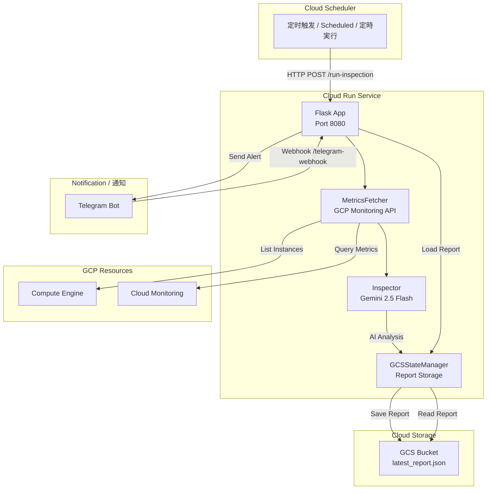

# GCP Monitoring Agent

<p align="center">
  
  
  
  
</p>

<p align="center">
  <b>🌐 选择语言 / Select Language / 言語を選択</b>
</p>

<p align="center">
  <a href="README_cn.md">🇨🇳 中文</a> |
  <a href="README_en.md">🇺🇸 English</a> |
  <a href="README_jp.md">🇯🇵 日本語</a>
</p>

---

## 📋 项目介绍 / Project Overview / プロジェクト概要

**GCP Monitoring Agent** 是一个智能的 GCP 资源巡检系统，部署于 Cloud Run，能够定时采集 GCE 实例指标，通过 Gemini 2.5 Flash AI 进行分析，并通过 Telegram Bot 推送告警。

> **GCP Monitoring Agent** is an intelligent GCP resource inspection system deployed on Cloud Run. It periodically collects GCE instance metrics, analyzes them using Gemini 2.5 Flash AI, and sends alerts via Telegram Bot.

> **GCP Monitoring Agent** は、Cloud Run 上にデプロイされるインテリジェントな GCP リソース監査システムです。定期的に GCE インスタンスのメトリクスを収集し、Gemini 2.5 Flash AI を用いて分析を行い、Telegram Bot 経由でアラートを通知します。

---

## 🏗️ 架构图 / Architecture / アーキテクチャ



---

## 🚀 快速开始 / Quick Start / クイックスタート

```bash
# Clone / 克隆 / クローン
git clone https://github.com/Winson-030/2026-monitor-agent.git
cd gcp-monitoring-agent

# Setup / 配置 / セットアップ
pip install -r requirements.txt
cp .env.example .env

# Run / 运行 / 実行
python main.py
```

---

## 📚 文档 / Documentation / ドキュメント

| 文档 / Document / ドキュメント | 中文 🇨🇳 | English 🇺🇸 | 日本語 🇯🇵 |
|-------------------------------|---------|------------|----------|
| **README (本文档)** | [中文](README_cn.md) | [English](README_en.md) | [日本語](README_jp.md) |
| **部署指南** | [中文](DEPLOYMENT_cn.md) | [English](DEPLOYMENT_en.md) | [日本語](DEPLOYMENT_jp.md) |
| **配置指南** | [中文](CONFIGURATION_cn.md) | [English](CONFIGURATION_en.md) | [日本語](CONFIGURATION_jp.md) |

---

## 💬 核心特性 / Key Features / 主な機能

| 特性 / Feature / 機能 | 说明 / Description / 説明 |
|---------------------|--------------------------|
| 🤖 **AI 驱动分析** | 使用 Gemini 2.5 Flash 智能分析监控指标 |
| 📊 **自动指标采集** | 基于 GCP Monitoring API 的确定性数据采集 |
| 💬 **Telegram 集成** | Bot 交互支持 (`/status`, `/inspect` 命令) |
| ☁️ **Cloud Run 部署** | 无服务器架构，按需付费 |
| 📁 **状态持久化** | GCS 存储巡检报告 |
| 🔧 **灵活配置** | YAML 配置 + 环境变量支持 |

---

## 📄 许可证 / License / ライセンス

[MIT License](LICENSE)

---

<p align="center">
  Made with ❤️ by <a href="https://github.com/Winson-030">Winson</a>
</p>
