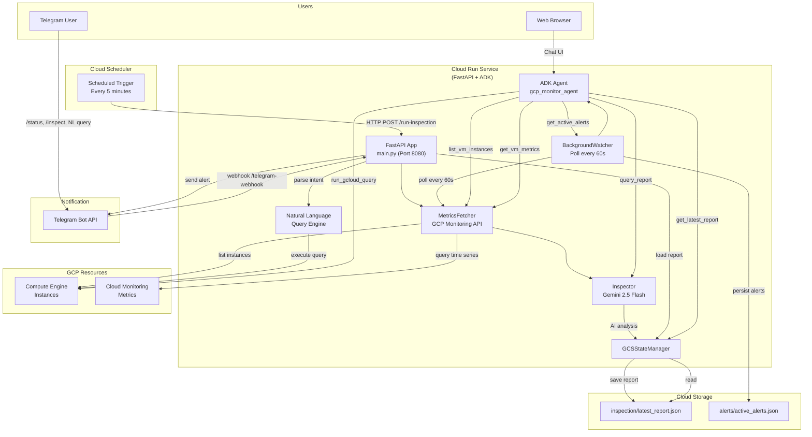
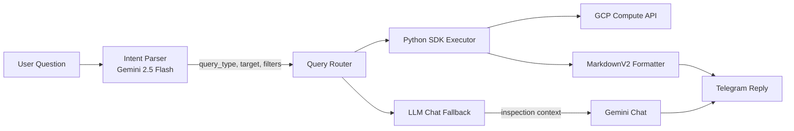

# GCP Monitoring Agent

<p align="center">
  
  
  
  
  
</p>

<p align="center">
  <b>An intelligent GCP resource monitoring system powered by AI</b>
</p>

<p align="center">
  <a href="README.md">🇺🇸 English (Full Docs)</a> |
  <a href="README_cn.md">🇨🇳 中文 (简介)</a> |
  <a href="README_jp.md">🇯🇵 日本語 (概要)</a>
</p>

---

## 📋 Overview

**GCP Monitoring Agent** is an intelligent GCP resource inspection and alerting system deployed on Cloud Run. It periodically collects GCE instance metrics, analyzes them with Gemini 2.5 Flash AI, and delivers alerts through **Telegram Bot** and an **ADK Web Chat** interface.

The agent understands **natural language queries** — you can ask "how many VMs are running?" or "which machines have high CPU?" and get real-time answers from GCP APIs.

---

## ✨ Key Features

| Feature | Description |
|---------|-------------|
| 🤖 **AI-Powered Analysis** | Gemini 2.5 Flash analyzes VM metrics with smart threshold assessment |
| 📊 **Automatic Metrics Collection** | CPU, memory, disk collected via GCP Monitoring API (every 5 min) |
| 💬 **Telegram Bot** | Full MarkdownV2 formatting, `/status`, `/inspect`, natural language chat |
| 🌐 **ADK Web Chat Interface** | Browser-based UI with 6 built-in monitoring tools |
| 🔍 **Natural Language GCP Queries** | Chinese/English intent recognition → real-time gcloud execution |
| 🚨 **Background Alert Watcher** | 60-second polling loop for instant threshold alerts |
| ☁️ **Cloud Run Deployment** | Serverless, pay-per-use, includes gcloud CLI in container |
| 📁 **GCS State Persistence** | Inspection reports + active alerts stored in Cloud Storage |
| 🔧 **Flexible Configuration** | YAML config + environment variables + multi-zone support |

---

## 🏗️ Architecture



---

## 🚀 Quick Start

### Local Development

```bash
# 1. Clone the repository
git clone https://github.com/Winson-030/2026-monitor-agent.git
cd gcp-monitoring-agent

# 2. Install dependencies
pip install -r requirements.txt

# 3. Install ADK dependency (for web chat)
pip install -r requirements-adk.txt

# 4. Configure
cp .env.example .env
# Edit .env with your Telegram Bot Token and Chat ID
# Edit config.yaml with your GCP project settings

# 5. Run the server
python main.py
```

### ADK Web Chat (standalone)

```bash
adk web --port 8000
# → Open http://localhost:8000
# → Select "gcp_monitor_agent" from the dropdown
```

---

## 💬 Telegram Bot

The Telegram bot supports both **command mode** and **natural language chat**.

### Commands

| Command | Description |
|---------|-------------|
| `/status` | View the latest inspection report with AI analysis |
| `/inspect <instance>` | Get real-time metrics + AI analysis for a specific VM |
| `/start` or `/help` | Show help message with available commands |

### Natural Language Queries

You can send free-form questions and the bot will automatically detect the intent:

| Question | What happens |
|----------|--------------|
| "有几台 VM？" | Intent recognition → `executor.get_vm_count()` → real-time count |
| "列出所有虚拟机" | Intent recognition → `executor.get_vm_list()` → formatted table |
| "VM 状态如何？" | Intent recognition → `executor.get_vm_status()` → status summary |
| "CPU 使用率高的 VM 有哪些" | Falls back to LLM chat with latest inspection report |
| "服务器怎么样？" | Falls back to LLM chat with AI-powered analysis |

The bot uses:
1. **Intent recognition** (`query/intent.py`) — LLM-parsed query types for structured queries
2. **Python SDK executor** (`query/executor.py`) — Real-time GCP Compute API calls
3. **Fallback chat** (`agents/inspector.py`) — Gemini-powered conversation on reports

### MarkdownV2 Formatting

All Telegram messages use Telegram **MarkdownV2** with proper character escaping for rich, readable formatting. If a message fails to send with MarkdownV2, it automatically falls back to plain text.

---

## 🌐 ADK Web Chat Interface

A browser-based chat interface powered by [Google Agent Development Kit (ADK)](https://google.github.io/adk-docs/).

### 6 Built-in Tools

| Tool | Description |
|------|-------------|
| `list_vm_instances(zone)` | List all VMs in a zone with status and machine type |
| `get_vm_metrics(instance, zone)` | Get real-time CPU/memory/disk metrics for a VM |
| `get_latest_report()` | Get the most recent inspection report from GCS |
| `get_active_alerts()` | Get current active alerts from BackgroundWatcher |
| `run_gcloud_query(command)` | Execute read-only gcloud CLI commands (sandboxed) |
| `query_report(question)` | Ask natural language questions about inspection data |

### Example Chat Questions

```text
# VM queries
"现在有几台 VM 在运行？"
"列出 us-central1-a 的所有实例"
"查看 vm-1 的 CPU 使用率"

# Reports & alerts
"最新的巡检报告有什么异常吗？"
"现在有没有告警？"
"帮我总结一下这个报告"

# Advanced (gcloud passthrough)
"gcloud compute instances list --format=json"
"查询 Cloud Run 服务列表"
```

### Smart Agent Behavior

The ADK agent automatically:
1. Checks active alerts at conversation start
2. Uses real-time tools over cached data when available
3. Routes to gcloud CLI for queries not covered by built-in tools
4. Responds in Chinese with emoji-enhanced formatting

---

## 🔍 Natural Language GCP Query System

A dedicated query engine that translates natural language into structured GCP API calls.

### Architecture



### Supported Query Types

| Type | Example | Source |
|------|---------|--------|
| `vm_count` | "有几台 VM？" | Compute Engine API |
| `vm_list` | "列出所有虚拟机" | Compute Engine API |
| `vm_status` | "VM 状态如何？" | Compute Engine API |
| `vm_metrics` | "CPU 使用率" | Monitoring API / Report |
| `zone_count` | "有几个可用区？" | Compute Engine API |
| `resource_summary` | "资源概况" | Compute Engine API |

---

## 🚨 Background VM Alert Watcher

A real-time alert system that continuously monitors VM metrics.

### How It Works

1. **Polling Loop** — `BackgroundWatcher` polls all RUNNING VMs every 60 seconds
2. **Threshold Check** — CPU and disk metrics are evaluated against configurable thresholds
3. **Alert Lifecycle** — Alerts are created on breach, cleared on recovery
4. **Persistence** — Active alerts saved to GCS (`alerts/active_alerts.json`) to survive Cloud Run restarts
5. **ADK Integration** — `get_active_alerts()` tool makes alerts accessible via web chat

### Default Thresholds

| Metric | Warning | Critical |
|--------|---------|----------|
| CPU | > 80% | > 90% |
| Disk | > 80% | > 90% |

### Alert Format

```json
{
  "vm": "instance-1",
  "zone": "us-central1-a",
  "trigger": "cpu",
  "value": 95.2,
  "threshold": 90,
  "level": "critical",
  "since": "2026-06-27T08:00:00Z",
  "last_updated": "2026-06-27T08:01:00Z"
}
```

---

## 💰 Cost Estimate

| Item | Monthly Cost |
|------|--------------|
| Cloud Run (1 vCPU, 512MB, ~500 requests/day) | ~$5-8 |
| Cloud Scheduler (1 job, every 5 min) | ~$0.50 |
| GCS (report + alert storage) | $0 |
| Gemini Flash API (~500 targets/day) | ~$0.30 |
| **Total** | **~$6-9/month** |

---

## 📂 Project Structure

```
gcp-monitoring-agent/
├── agents/                     # AI analysis modules
│   ├── __init__.py             # Module exports (no ADK import)
│   ├── agent.py                # ADK agent: gcp_monitor_agent + 6 tools
│   ├── inspector.py            # Gemini 2.5 Flash analyzer + chat
│   └── prompts.py              # System prompts for each mode
│
├── fetcher/
│   └── metrics.py              # GCP Monitoring API data collection
│
├── notify/
│   └── telegram.py             # Telegram Bot (MarkdownV2, webhook, NL queries)
│
├── query/                      # Natural language GCP query engine (NEW)
│   ├── __init__.py             # Module exports
│   ├── intent.py               # LLM-based intent recognition
│   └── executor.py             # Python SDK query execution
│
├── store/
│   └── state_manager.py        # GCS state persistence (reports + alerts)
│
├── main.py                     # FastAPI + ADK entry point (Telegram + Scheduler)
├── main_adk.py                 # Standalone ADK web chat server
├── orchestrator.py             # Inspection orchestration loop
├── scheduler.py                # BackgroundWatcher: 60s alert polling (NEW)
├── config.py                   # YAML configuration loader
├── config.yaml                 # Configuration file
│
├── requirements.txt            # Core dependencies
├── requirements-adk.txt        # ADK dependencies (google-adk)
├── .env.example                # Environment variable template
│
└── Dockerfile                  # Multi-stage build with gcloud CLI
```

---

## 📚 Documentation

| Document | English | 中文 | 日本語 |
|----------|---------|------|--------|
| **Main README** | 🇺🇸 Full Docs | 🇨🇳 中文简介 | 🇯🇵 日本語概要 |
| **Deployment Guide** | [DEPLOYMENT_en.md](DEPLOYMENT_en.md) | [DEPLOYMENT_cn.md](DEPLOYMENT_cn.md) | [DEPLOYMENT_jp.md](DEPLOYMENT_jp.md) |
| **Configuration Guide** | [CONFIGURATION_en.md](CONFIGURATION_en.md) | [CONFIGURATION_cn.md](CONFIGURATION_cn.md) | [CONFIGURATION_jp.md](CONFIGURATION_jp.md) |

---

## 📋 Changelog

| Version | Date | Highlights |
|---------|------|------------|
| v13 | 2026-06-27 | ADK import fix — removed ADK from `agents/__init__.py` |
| v12 | 2026-06-27 | ADK web chat interface — consolidated 6 tools in `agents/agent.py` |
| v11 | 2026-06-27 | Natural language GCP queries — intent recognition + executor |
| v10 | 2026-06-27 | Telegram MarkdownV2 support — proper escaping & formatting |
| v1-9 | 2026-06-27 | Initial MVP: GCP monitoring, Gemini analysis, Flask + Telegram |

### Latest Additions

- **`scheduler.py`** — BackgroundWatcher: real-time 60s VM alert monitoring with GCS persistence (v13+)
- **`Dockerfile`** — Now includes gcloud CLI for `run_gcloud_query` tool
- **`config.py`** — Dataclass-based YAML configuration loader
- **Architecture** — Migrated from Flask to FastAPI + ADK unified entry point

---

## 🤝 Contributing

Contributions are welcome! Please submit issues and pull requests to the repository.

---

## 📄 License

This project is licensed under the [MIT License](LICENSE).

---

<p align="center">
  Made with ❤️ by <a href="https://github.com/Winson-030">Winson</a>
</p>
