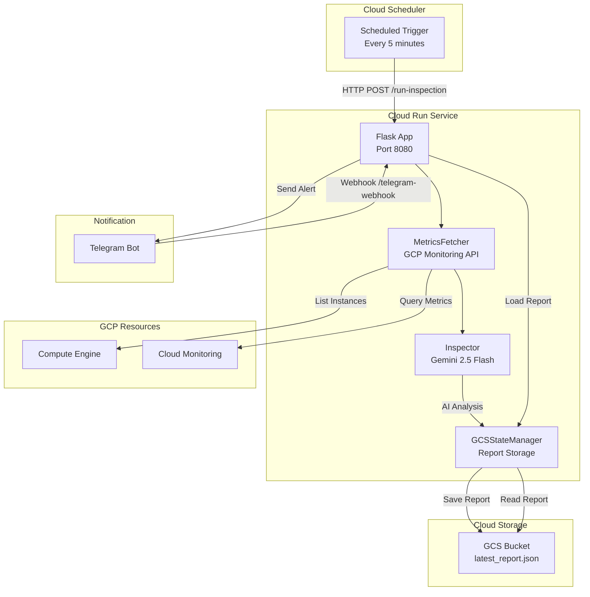
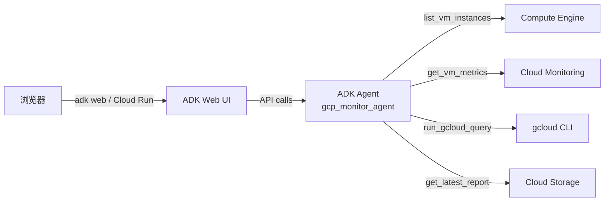

# GCP Monitoring Agent

<p align="center">
  
  
  
  
</p>

<p align="center">
  <b>An intelligent GCP resource monitoring system powered by AI</b>
</p>

<p align="center">
  <a href="README.md">🇺🇸 English (Full Docs)</a> |
  <a href="README_cn.md">🇨🇳 中文 (简介)</a> |
  <a href="README_jp.md">🇯🇵 日本語 (概要)</a>
</p>

---

## 📋 Overview

**GCP Monitoring Agent** is an intelligent GCP resource inspection system deployed on Cloud Run. It periodically collects GCE instance metrics, analyzes them using Gemini 2.5 Flash AI, and sends alerts via Telegram Bot.

### Key Features

- 🤖 **AI-Powered Analysis** - Smart metric analysis with Gemini 2.5 Flash
- 📊 **Automatic Metrics Collection** - Deterministic data collection via GCP Monitoring API
- 💬 **Telegram Integration** - Interactive Bot with `/status`, `/inspect` commands
- ☁️ **Cloud Run Deployment** - Serverless architecture with pay-per-use pricing
- 📁 **State Persistence** - Inspection reports stored in GCS
- 🔧 **Flexible Configuration** - YAML config + environment variables
- 🌐 **Web Chat Interface** — Real-time GCP queries via Google ADK web UI

---

## 🏗️ Architecture



---

## 🚀 Quick Start

```bash
# 1. Clone the repository
git clone https://github.com/Winson-030/2026-monitor-agent.git
cd gcp-monitoring-agent

# 2. Install dependencies
pip install -r requirements.txt

# 3. Configure and run
cp .env.example .env
# Edit .env with your configuration
python main.py
```

---

## 📚 Documentation

| Document | English | 中文 | 日本語 |
|----------|---------|------|--------|
| **Main README** | [Full Documentation](README.md) | [中文简介](README_cn.md) | [日本語概要](README_jp.md) |
| **Deployment Guide** | [DEPLOYMENT_en.md](DEPLOYMENT_en.md) | [DEPLOYMENT_cn.md](DEPLOYMENT_cn.md) | [DEPLOYMENT_jp.md](DEPLOYMENT_jp.md) |
| **Configuration Guide** | [CONFIGURATION_en.md](CONFIGURATION_en.md) | [CONFIGURATION_cn.md](CONFIGURATION_cn.md) | [CONFIGURATION_jp.md](CONFIGURATION_jp.md) |

> **Note**: The English documentation is the primary and most comprehensive version. Chinese and Japanese versions provide quick reference with links to full English documentation.

---

## 🌐 Web Chat Interface (New!)

In addition to the Telegram bot, the agent provides a **web-based chat interface** powered by [Google ADK](https://google.github.io/adk-docs/).

### How It Works

The ADK agent (`gcp_monitor_agent`) wraps existing monitoring modules as tools that Gemini 2.5 Flash can invoke based on natural language input.



### Available Tools

| Tool | Description |
|------|-------------|
| `list_vm_instances` | 列出 zone 内所有 VM 实例及状态 |
| `get_vm_metrics` | 获取单个 VM 的实时 CPU/内存/磁盘 |
| `get_latest_report` | 读取最新的巡检缓存报告 |
| `run_gcloud_query` | 执行安全的只读 gcloud 命令 |
| `query_report` | 基于巡检报告用自然语言问答 |

### Quick Start

```bash
# Install ADK dependency
pip install -r requirements-adk.txt

# Start the web UI (run from project root)
adk web --port 8000

# → Open http://localhost:8000
# → Select "gcp_monitor_agent" from dropdown
# → Start chatting!
```

### Example Questions

```text
- "现在有几台 VM 在运行？"
- "列出 us-central1-a 的所有实例"
- "查看 vm-1 的 CPU 使用率"
- "最新的巡检报告有什么异常吗？"
- "执行 gcloud compute instances list"
```

See [DEPLOYMENT_adk.md](DEPLOYMENT_adk.md) for full deployment guide.

---

## 💰 Cost Estimate

| Item | Monthly Cost |
|------|--------------|
| Cloud Run (1 vCPU, 512MB, 200 requests/day) | ~$5-8 |
| Cloud Scheduler (3 jobs) | ~$0.50 |
| GCS (report storage) | $0 |
| Gemini Flash API (~500 targets/day) | ~$0.30 |
| **Total** | **~$6-9/month** |

---

## 📂 Project Structure

```
gcp-monitoring-agent/
├── agents/                 # AI analysis modules
│   ├── inspector.py       # Gemini analyzer
│   ├── prompts.py         # System prompts
│   └── adk_agent/         # ADK web chat agent
│       ├── agent.py       # Agent definition (gcp_monitor_agent)
│       ├── tools.py       # Tool functions (5 tools)
│       └── .env           # Agent environment template
├── fetcher/               # Data collection modules
│   └── metrics.py         # GCP metrics fetching
├── notify/                # Notification modules
│   └── telegram.py        # Telegram Bot
├── store/                 # Storage modules
│   └── state_manager.py   # GCS state management
├── main.py                # Flask application entry
├── main_adk.py            # ADK FastAPI entry point
├── orchestrator.py        # Inspection orchestration
├── config.yaml            # Configuration file
├── requirements.txt       # Python dependencies
├── requirements-adk.txt   # ADK dependencies
├── Dockerfile             # Container image (Flask)
├── Dockerfile.adk         # Container image (ADK web)
├── DEPLOYMENT_adk.md      # ADK deployment guide
```

---

## 🤝 Contributing

Contributions are welcome! Please see the detailed sections below for contribution guidelines.

---

## 📄 License

This project is licensed under the [MIT License](LICENSE).

---

<p align="center">
  Made with ❤️ by <a href="https://github.com/Winson-030">Winson</a>
</p>
