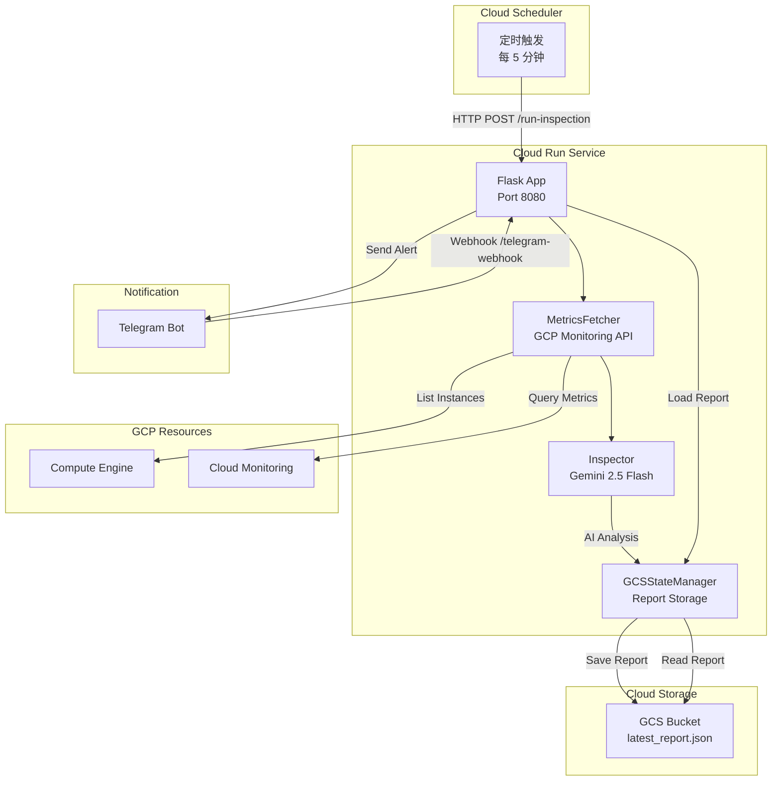

# GCP Monitoring Agent

<p align="center">
  
  
  
  
</p>

## 📋 项目介绍

**GCP Monitoring Agent** 是一个智能的 GCP 资源巡检系统，部署于 Cloud Run，能够定时采集 GCE 实例指标，通过 Gemini 2.5 Flash AI 进行分析，并通过 Telegram Bot 推送告警。

### 核心特性

- 🤖 **AI 驱动分析** - 使用 Gemini 2.5 Flash 智能分析监控指标
- 📊 **自动指标采集** - 基于 GCP Monitoring API 的确定性数据采集
- 💬 **Telegram 集成** - Bot 交互支持 (`/status`, `/inspect` 命令)
- ☁️ **Cloud Run 部署** - 无服务器架构，按需付费
- 📁 **状态持久化** - GCS 存储巡检报告
- 🔧 **灵活配置** - YAML 配置 + 环境变量支持

---

## 🏗️ 架构图



### 组件说明

| 组件 | 说明 | 技术 |
|------|------|------|
| **MetricsFetcher** | 采集 GCE 实例的 CPU/磁盘/状态指标 | `google-cloud-monitoring`, `google-cloud-compute` |
| **Inspector** | Gemini AI 分析指标并判定状态 | `vertexai`, Gemini 2.5 Flash |
| **GCSStateManager** | 巡检报告存储与读取 | `google-cloud-storage` |
| **TelegramHandler** | Bot 消息推送与交互处理 | Telegram Bot API |
| **Orchestrator** | 巡检流程编排 | Python 类 |

---

## 🚀 快速开始

### 前提条件

- Python 3.13+
- GCP 项目并启用相关 API
- Telegram Bot Token
- GCS Bucket

### 本地开发

```bash
# 1. 克隆仓库
git clone https://github.com/Winson-030/2026-monitor-agent.git
cd gcp-monitoring-agent

# 2. 创建虚拟环境
python -m venv venv
source venv/bin/activate  # Linux/Mac
# Windows: venv\Scripts\activate

# 3. 安装依赖
pip install -r requirements.txt

# 4. 配置环境变量
cp .env.example .env
# 编辑 .env 文件，填入你的配置

# 5. 运行
python main.py
```

### API 端点

| 端点 | 方法 | 说明 |
|------|------|------|
| `/run-inspection` | POST | 执行巡检任务 |
| `/telegram-webhook` | POST | Telegram Webhook |
| `/healthz` | GET | 健康检查 |

---

## 📦 部署到 Cloud Run

### 1. 启用所需 API

```bash
gcloud services enable run.googleapis.com
gcloud services enable monitoring.googleapis.com
gcloud services enable compute.googleapis.com
gcloud services enable storage.googleapis.com
gcloud services enable aiplatform.googleapis.com
gcloud services enable cloudbuild.googleapis.com
```

### 2. 构建并部署

```bash
# 构建镜像
gcloud builds submit --tag gcr.io/$PROJECT_ID/gcp-monitor

# 部署到 Cloud Run
gcloud run deploy gcp-monitor \
  --image gcr.io/$PROJECT_ID/gcp-monitor \
  --region us-central1 \
  --platform managed \
  --allow-unauthenticated \
  --set-env-vars="TELEGRAM_BOT_TOKEN=your-bot-token" \
  --set-env-vars="TELEGRAM_CHAT_ID=your-chat-id"
```

详细部署步骤请参见 [DEPLOYMENT_cn.md](DEPLOYMENT_cn.md)。

---

## ⚙️ 配置说明

### config.yaml

```yaml
gcp:
  project_id: "your-project-id"      # GCP 项目 ID
  region: "us-central1"              # 默认区域
  default_zone: "us-central1-a"      # 默认可用区

thresholds:
  cpu_critical: 90                   # CPU 危急阈值 (%)
  cpu_warning: 80                    # CPU 警告阈值 (%)
  disk_critical: 90                  # 磁盘危急阈值 (%)
  disk_warning: 80                   # 磁盘警告阈值 (%)

gcs_bucket: "your-bucket-name"       # GCS Bucket 名称

budget:
  daily_max_usd: 3.0                 # 每日预算上限 (USD)

inspection:
  zones:                             # 巡检区域列表
    - "us-central1-a"
    - "us-central1-b"
```

### 环境变量

| 变量名 | 必填 | 说明 |
|--------|------|------|
| `TELEGRAM_BOT_TOKEN` | ✅ | Telegram Bot Token (@BotFather 获取) |
| `TELEGRAM_CHAT_ID` | ✅ | Telegram 聊天 ID |
| `GOOGLE_CLOUD_PROJECT` | - | GCP 项目 ID |
| `GOOGLE_APPLICATION_CREDENTIALS` | - | 服务账号密钥路径（本地开发） |

详细配置说明请参见 [CONFIGURATION_cn.md](CONFIGURATION_cn.md)。

---

## 💬 Telegram Bot 命令

| 命令 | 说明 |
|------|------|
| `/status` | 查看最新的巡检报告 |
| `/inspect <实例名>` | 查看指定实例的详细分析 |
| 任意文字 | 智能问答（基于最新报告） |

---

## 📁 项目结构

```
gcp-monitoring-agent/
├── agents/                 # AI 分析模块
│   ├── __init__.py
│   ├── inspector.py       # Gemini 分析器
│   └── prompts.py         # 系统提示词
├── fetcher/               # 数据采集模块
│   ├── __init__.py
│   └── metrics.py         # GCP 指标获取
├── notify/                # 通知模块
│   ├── __init__.py
│   └── telegram.py        # Telegram Bot
├── store/                 # 存储模块
│   ├── __init__.py
│   └── state_manager.py   # GCS 状态管理
├── main.py                # Flask 应用入口
├── orchestrator.py        # 巡检流程编排
├── config.yaml            # 配置文件
├── requirements.txt       # Python 依赖
├── Dockerfile             # 容器镜像
└── .env.example           # 环境变量示例
```

---

## 🤝 贡献指南

我们欢迎所有形式的贡献！

1. **Fork** 本仓库
2. 创建你的 **Feature Branch** (`git checkout -b feature/AmazingFeature`)
3. **Commit** 你的更改 (`git commit -m 'Add some AmazingFeature'`)
4. **Push** 到分支 (`git push origin feature/AmazingFeature`)
5. 打开 **Pull Request**

---

## 📄 许可证

本项目采用 [MIT License](LICENSE) 开源许可证。

---

## 📚 文档

- [English Documentation](README_en.md)
- [日本語ドキュメント (Japanese)](README_jp.md)
- [部署指南 (Chinese)](DEPLOYMENT_cn.md)
- [配置指南 (Chinese)](CONFIGURATION_cn.md)

---

<p align="center">
  Made with ❤️ by <a href="https://github.com/Winson-030">Winson</a>
</p>
