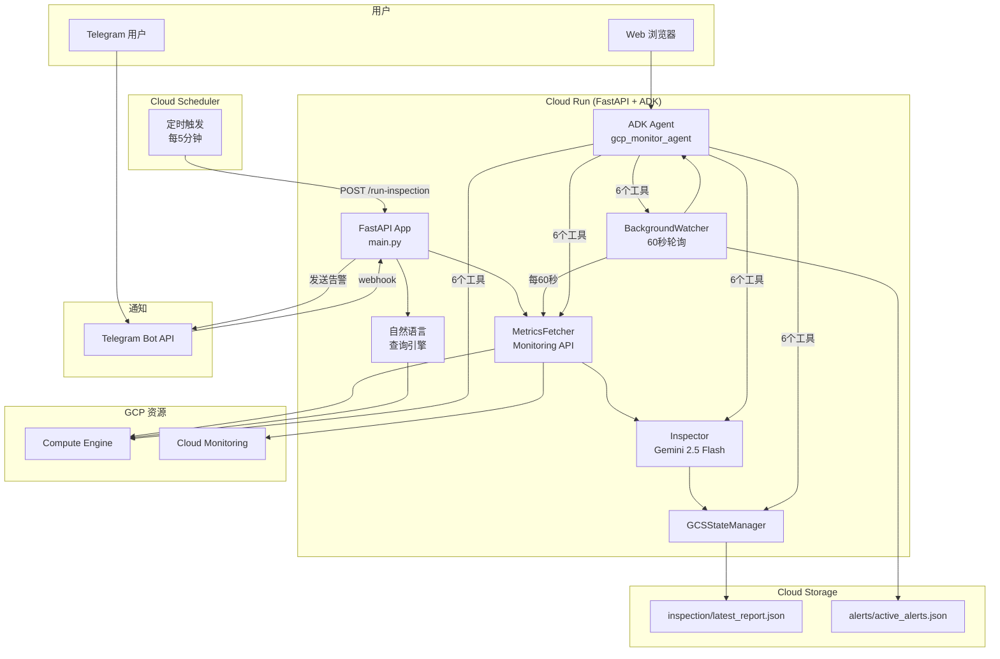

# GCP Monitoring Agent

<p align="center">
  
  
  
  
  
</p>

> ⚠️ **本文档为快速参考，完整文档请参见 [English Version](README.md)。**

---

## 📋 项目简介

**GCP Monitoring Agent** 是一个智能的 GCP 资源巡检与告警系统，部署于 Cloud Run。它能定时采集 GCE 实例指标，通过 Gemini 2.5 Flash AI 进行分析，并通过 **Telegram Bot** 和 **ADK Web 聊天** 界面推送告警。

系统支持**自然语言查询**——你可以直接问"有几台 VM 在运行？"或"哪些机器 CPU 高？"，系统会通过 GCP API 实时获取答案。

---

## ✨ 核心特性

| 特性 | 说明 |
|------|------|
| 🤖 **AI 驱动分析** | Gemini 2.5 Flash 智能评估 VM 指标 |
| 📊 **自动指标采集** | CPU/内存/磁盘每5分钟采集一次 |
| 💬 **Telegram Bot** | MarkdownV2 格式化，`/status`、`/inspect`、自然语言聊天 |
| 🌐 **ADK Web 聊天界面** | 浏览器端 UI，内置6个监控工具 |
| 🔍 **自然语言 GCP 查询** | 意图识别 → Python SDK 实时执行 |
| 🚨 **后台告警监控器** | 60秒轮询检测阈值越界 |
| ☁️ **Cloud Run 部署** | 无服务器，按需付费，内置 gcloud CLI |
| 📁 **GCS 状态持久化** | 巡检报告 + 告警持久化到 Cloud Storage |
| 🔧 **灵活配置** | YAML 配置 + 环境变量 + 多区域支持 |

---

## 🏗️ 系统架构



---

## 🚀 快速开始

```bash
# 1. 克隆仓库
git clone https://github.com/Winson-030/2026-monitor-agent.git
cd gcp-monitoring-agent

# 2. 安装依赖
pip install -r requirements.txt
pip install -r requirements-adk.txt

# 3. 配置
cp .env.example .env
# 编辑 .env 和 config.yaml

# 4. 运行
python main.py
```

### ADK Web 聊天

```bash
adk web --port 8000
# → http://localhost:8000 → 选择 "gcp_monitor_agent"
```

---

## 💬 Telegram Bot 命令

| 命令 | 说明 |
|------|------|
| `/status` | 查看最新巡检报告（AI分析） |
| `/inspect <实例名>` | 查看指定 VM 的实时指标 + AI分析 |
| `/help` | 显示帮助信息 |

### 自然语言查询示例

```
"有几台 VM？" → 实时统计 VM 数量
"列出所有虚拟机" → 格式化表格展示
"VM 状态如何？" → 状态汇总
"CPU 使用率高的 VM" → LLM 聊天回退
```

---

## 🌐 ADK Web 聊天（6个内置工具）

| 工具 | 说明 |
|------|------|
| `list_vm_instances(zone)` | 列出指定区域的所有 VM |
| `get_vm_metrics(instance, zone)` | 获取 VM 实时 CPU/内存/磁盘 |
| `get_latest_report()` | 获取最新巡检报告 |
| `get_active_alerts()` | 获取当前活跃告警 |
| `run_gcloud_query(command)` | 执行只读 gcloud 命令 |
| `query_report(question)` | 基于巡检报告回答自然语言问题 |

---

## 🔍 自然语言 GCP 查询系统

将用户问题解析为结构化的 GCP API 调用。

**支持的查询类型：**

| 类型 | 示例 | 数据源 |
|------|------|--------|
| `vm_count` | "有几台 VM？" | Compute Engine API |
| `vm_list` | "列出所有虚拟机" | Compute Engine API |
| `vm_status` | "VM 状态如何？" | Compute Engine API |
| `vm_metrics` | "CPU 使用率" | Monitoring API |
| `zone_count` | "有几个可用区？" | Compute Engine API |
| `resource_summary` | "资源概况" | Compute Engine API |

---

## 🚨 后台告警监控器

**BackgroundWatcher** 每60秒扫描所有 RUNNING VM：

| 指标 | 警告阈值 | 严重阈值 |
|------|---------|---------|
| CPU | > 80% | > 90% |
| 磁盘 | > 80% | > 90% |

告警持久化到 GCS，Cloud Run 重启后自动恢复。

---

## 💰 成本估算

| 项目 | 月费用 |
|------|--------|
| Cloud Run（1 vCPU, 512MB） | ~$5-8 |
| Cloud Scheduler | ~$0.50 |
| GCS 存储 | $0 |
| Gemini Flash API | ~$0.30 |
| **合计** | **~$6-9/月** |

---

## 📂 项目结构

```
gcp-monitoring-agent/
├── agents/                # AI 分析模块
│   ├── agent.py           # ADK 智能体 + 6个工具
│   ├── inspector.py       # Gemini 分析 + 聊天
│   └── prompts.py         # 系统提示词
├── fetcher/metrics.py     # 指标采集
├── notify/telegram.py     # Telegram Bot (MarkdownV2, NL查询)
├── query/                 # 自然语言查询引擎
│   ├── intent.py          # 意图识别
│   └── executor.py        # Python SDK 执行
├── store/state_manager.py # GCS 持久化
├── main.py                # FastAPI + ADK 统一入口
├── main_adk.py            # ADK Web 聊天服务器
├── orchestrator.py        # 巡检编排
├── scheduler.py           # 后台告警监控器
├── config.py / config.yaml
├── requirements.txt / requirements-adk.txt
└── Dockerfile             # 含 gcloud CLI 的容器
```

---

## 📚 完整文档

| 文档 | 链接 |
|------|------|
| **完整 README** | [English Version](README.md) |
| **部署指南** | [DEPLOYMENT_en.md](DEPLOYMENT_en.md) |
| **配置指南** | [CONFIGURATION_en.md](CONFIGURATION_en.md) |

## 📄 许可证

[MIT License](LICENSE)

---

<p align="center">
  Made with ❤️ by <a href="https://github.com/Winson-030">Winson</a>
</p>
