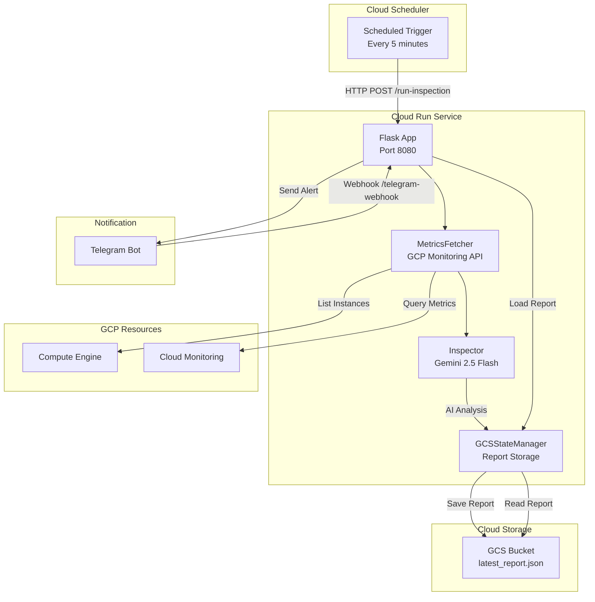

# GCP Monitoring Agent

<p align="center">
  
  
  
  
</p>

## 📋 Project Overview

**GCP Monitoring Agent** is an intelligent GCP resource inspection system deployed on Cloud Run. It periodically collects GCE instance metrics, analyzes them using Gemini 2.5 Flash AI, and sends alerts via Telegram Bot.

### Key Features

- 🤖 **AI-Powered Analysis** - Smart metric analysis with Gemini 2.5 Flash
- 📊 **Automatic Metrics Collection** - Deterministic data collection based on GCP Monitoring API
- 💬 **Telegram Integration** - Bot interaction with `/status`, `/inspect` commands
- ☁️ **Cloud Run Deployment** - Serverless architecture with pay-per-use
- 📁 **State Persistence** - Inspection reports stored in GCS
- 🔧 **Flexible Configuration** - YAML config + environment variables

---

## 🏗️ Architecture



### Component Reference

| Component | Description | Technologies |
|-----------|-------------|--------------|
| **MetricsFetcher** | Collects CPU/disk/status metrics from GCE instances | `google-cloud-monitoring`, `google-cloud-compute` |
| **Inspector** | Gemini AI analyzes metrics and determines status | `vertexai`, Gemini 2.5 Flash |
| **GCSStateManager** | Storage and retrieval of inspection reports | `google-cloud-storage` |
| **TelegramHandler** | Bot message delivery and interaction handling | Telegram Bot API |
| **Orchestrator** | Inspection workflow orchestration | Python class |

---

## 🚀 Quick Start

### Prerequisites

- Python 3.13+
- GCP project with APIs enabled
- Telegram Bot Token
- GCS Bucket

### Local Development

```bash
# 1. Clone the repository
git clone https://github.com/Winson-030/2026-monitor-agent.git
cd gcp-monitoring-agent

# 2. Create virtual environment
python -m venv venv
source venv/bin/activate  # Linux/Mac
# or: venv\Scripts\activate  # Windows

# 3. Install dependencies
pip install -r requirements.txt

# 4. Configure environment variables
cp .env.example .env
# Edit .env with your configuration

# 5. Run
python main.py
```

### API Endpoints

| Endpoint | Method | Description |
|----------|--------|-------------|
| `/run-inspection` | POST | Run inspection job |
| `/telegram-webhook` | POST | Telegram Webhook |
| `/healthz` | GET | Health check |

---

## 📦 Deploy to Cloud Run

### 1. Enable Required APIs

```bash
gcloud services enable run.googleapis.com
gcloud services enable monitoring.googleapis.com
gcloud services enable compute.googleapis.com
gcloud services enable storage.googleapis.com
gcloud services enable aiplatform.googleapis.com
gcloud services enable cloudbuild.googleapis.com
```

### 2. Build and Deploy

```bash
# Build image
gcloud builds submit --tag gcr.io/$PROJECT_ID/gcp-monitor

# Deploy to Cloud Run
gcloud run deploy gcp-monitor \
  --image gcr.io/$PROJECT_ID/gcp-monitor \
  --region us-central1 \
  --platform managed \
  --allow-unauthenticated \
  --set-env-vars="TELEGRAM_BOT_TOKEN=your-bot-token" \
  --set-env-vars="TELEGRAM_CHAT_ID=your-chat-id"
```

See [DEPLOYMENT_en.md](DEPLOYMENT_en.md) for detailed deployment steps.

---

## ⚙️ Configuration

### config.yaml

```yaml
gcp:
  project_id: "your-project-id"      # GCP Project ID
  region: "us-central1"              # Default region
  default_zone: "us-central1-a"      # Default zone

thresholds:
  cpu_critical: 90                   # CPU critical threshold (%)
  cpu_warning: 80                    # CPU warning threshold (%)
  disk_critical: 90                  # Disk critical threshold (%)
  disk_warning: 80                   # Disk warning threshold (%)

gcs_bucket: "your-bucket-name"       # GCS Bucket name

budget:
  daily_max_usd: 3.0                 # Daily budget limit (USD)

inspection:
  zones:                             # Zones to inspect
    - "us-central1-a"
    - "us-central1-b"
```

### Environment Variables

| Variable | Required | Description |
|----------|----------|-------------|
| `TELEGRAM_BOT_TOKEN` | ✅ | Telegram Bot Token (from @BotFather) |
| `TELEGRAM_CHAT_ID` | ✅ | Telegram Chat ID |
| `GOOGLE_CLOUD_PROJECT` | - | GCP Project ID |
| `GOOGLE_APPLICATION_CREDENTIALS` | - | Service account key path (local dev) |

See [CONFIGURATION_en.md](CONFIGURATION_en.md) for detailed configuration.

---

## 💬 Telegram Bot Commands

| Command | Description |
|---------|-------------|
| `/status` | View latest inspection report |
| `/inspect <instance>` | View detailed analysis for specific instance |
| Any text | Smart Q&A based on latest report |

---

## 📁 Project Structure

```
gcp-monitoring-agent/
├── agents/                 # AI analysis modules
│   ├── __init__.py
│   ├── inspector.py       # Gemini analyzer
│   └── prompts.py         # System prompts
├── fetcher/               # Data collection modules
│   ├── __init__.py
│   └── metrics.py         # GCP metrics fetching
├── notify/                # Notification modules
│   ├── __init__.py
│   └── telegram.py        # Telegram Bot
├── store/                 # Storage modules
│   ├── __init__.py
│   └── state_manager.py   # GCS state management
├── main.py                # Flask application entry
├── orchestrator.py        # Inspection orchestration
├── config.yaml            # Configuration file
├── requirements.txt       # Python dependencies
├── Dockerfile             # Container image
└── .env.example           # Environment variables example
```

---

## 🤝 Contributing

We welcome all forms of contributions!

1. **Fork** this repository
2. Create your **Feature Branch** (`git checkout -b feature/AmazingFeature`)
3. **Commit** your changes (`git commit -m 'Add some AmazingFeature'`)
4. **Push** to the branch (`git push origin feature/AmazingFeature`)
5. Open a **Pull Request**

---

## 📄 License

This project is licensed under the [MIT License](LICENSE).

---

## 📚 Documentation

- [中文文档 (Chinese)](README_cn.md)
- [日本語ドキュメント (Japanese)](README_jp.md)
- [Deployment Guide (English)](DEPLOYMENT_en.md)
- [Configuration Guide (English)](CONFIGURATION_en.md)

---

<p align="center">
  Made with ❤️ by <a href="https://github.com/Winson-030">Winson</a>
</p>
