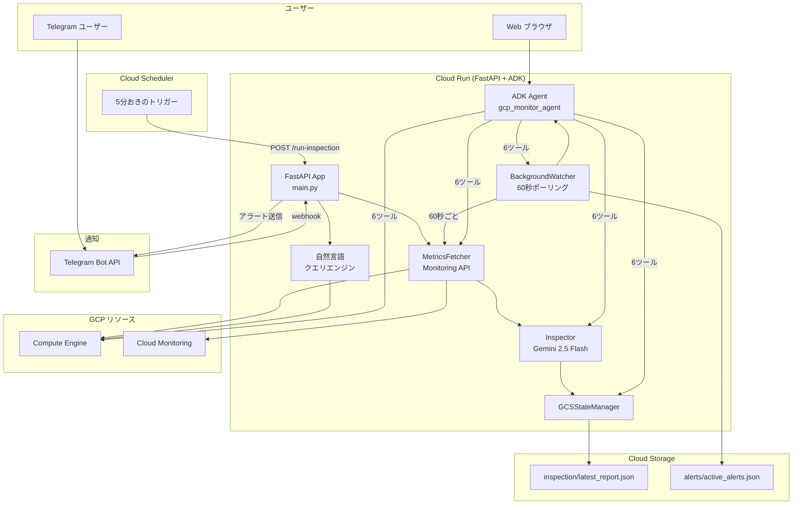

# GCP Monitoring Agent

<p align="center">
  
  
  
  
  
</p>

> ⚠️ **本文書はクイックリファレンスです。完全なドキュメントは [English Version](README.md) をご覧ください。**

---

## 📋 プロジェクト概要

**GCP Monitoring Agent** は、Cloud Run 上で動作するインテリジェントな GCP リソース監視・アラートシステムです。GCE インスタンスのメトリクスを定期的に収集し、Gemini 2.5 Flash AI で分析、**Telegram Bot** と **ADK Web チャット** を通じてアラートを通知します。

自然言語クエリに対応しており、「稼働中の VM は何台？」「CPU 使用率が高い VM は？」といった質問にリアルタイムで回答できます。

---

## ✨ 主な機能

| 機能 | 説明 |
|------|------|
| 🤖 **AI 分析** | Gemini 2.5 Flash によるスマートなしきい値評価 |
| 📊 **自動メトリクス収集** | CPU/メモリ/ディスクを5分おきに収集 |
| 💬 **Telegram Bot** | MarkdownV2 書式対応、`/status`、`/inspect`、自然言語チャット |
| 🌐 **ADK Web チャット** | ブラウザベース UI、6つの監視ツール内蔵 |
| 🔍 **自然言語 GCP クエリ** | 意図認識 → Python SDK でリアルタイム実行 |
| 🚨 **バックグラウンド監視** | 60秒間隔で VM を監視し、しきい値超過を即座にアラート |
| ☁️ **Cloud Run デプロイ** | サーバーレス、従量課金、gcloud CLI 内蔵 |
| 📁 **GCS 永続化** | レポート + アラートを Cloud Storage に保存 |
| 🔧 **柔軟な設定** | YAML + 環境変数 + マルチゾーン対応 |

---

## 🏗️ アーキテクチャ



---

## 🚀 クイックスタート

```bash
# 1. クローン
git clone https://github.com/Winson-030/2026-monitor-agent.git
cd gcp-monitoring-agent

# 2. 依存関係をインストール
pip install -r requirements.txt
pip install -r requirements-adk.txt

# 3. 設定
cp .env.example .env
# .env と config.yaml を編集

# 4. 起動
python main.py
```

### ADK Web チャット

```bash
adk web --port 8000
# → http://localhost:8000 → "gcp_monitor_agent" を選択
```

---

## 💬 Telegram コマンド

| コマンド | 説明 |
|---------|------|
| `/status` | 最新の巡检报告を表示（AI分析付き） |
| `/inspect <インスタンス>` | 特定 VM のリアルタイム指標 + AI分析 |
| `/help` | ヘルプ表示 |

### 自然言語クエリ例

```
"有几台 VM？" → VM 台数をリアルタイム集計
"列出所有虚拟机" → 全 VM 一覧表示
"VM 状态如何？" → ステータスサマリー
"CPU 使用率高的 VM" → LLM チャットフォールバック
```

---

## 🌐 ADK Web チャット（6つのツール）

| ツール | 説明 |
|--------|------|
| `list_vm_instances(zone)` | ゾーン内の全 VM 一覧 |
| `get_vm_metrics(instance, zone)` | VM のリアルタイム CPU/メモリ/ディスク |
| `get_latest_report()` | 最新の巡检報告を取得 |
| `get_active_alerts()` | 現在のアクティブアラートを取得 |
| `run_gcloud_query(command)` | 読み取り専用 gcloud コマンド実行 |
| `query_report(question)` | 巡检データについて自然語言語で質問 |

---

## 🔍 自然言語 GCP クエリシステム

質問を解析し、構造化された GCP API 呼び出しに変換します。

**対応クエリタイプ:**

| タイプ | 例 | ソース |
|--------|-----|--------|
| `vm_count` | "有几台 VM？" | Compute Engine API |
| `vm_list` | "列出所有虚拟机" | Compute Engine API |
| `vm_status` | "VM 状态如何？" | Compute Engine API |
| `vm_metrics` | "CPU 使用率" | Monitoring API |
| `zone_count` | "有几个可用区？" | Compute Engine API |
| `resource_summary` | "资源概况" | Compute Engine API |

---

## 🚨 バックグラウンドアラート監視

**BackgroundWatcher** が60秒ごとに全 RUNNING VM をスキャン：

| 指標 | 警告 | クリティカル |
|------|------|------------|
| CPU | > 80% | > 90% |
| ディスク | > 80% | > 90% |

アラートは GCS に永続化され、Cloud Run 再起動後も維持されます。

---

## 💰 コスト見積もり

| 項目 | 月額費用 |
|------|----------|
| Cloud Run（1 vCPU, 512MB） | ~$5-8 |
| Cloud Scheduler | ~$0.50 |
| GCS ストレージ | $0 |
| Gemini Flash API | ~$0.30 |
| **合計** | **~$6-9/月** |

---

## 📂 プロジェクト構造

```
gcp-monitoring-agent/
├── agents/                # AI 分析モジュール
│   ├── agent.py           # ADK エージェント + 6ツール
│   ├── inspector.py       # Gemini 分析 + チャット
│   └── prompts.py         # システムプロンプト
├── fetcher/metrics.py     # メトリクス収集
├── notify/telegram.py     # Telegram Bot (MarkdownV2, NL)
├── query/                 # 自然言語クエリエンジン
│   ├── intent.py          # 意図認識
│   └── executor.py        # Python SDK 実行
├── store/state_manager.py # GCS 永続化
├── main.py                # FastAPI + ADK エントリポイント
├── main_adk.py            # ADK Web チャットサーバー
├── orchestrator.py        # 巡检オーケストレーション
├── scheduler.py           # バックグラウンド監視器
├── config.py / config.yaml
├── requirements.txt / requirements-adk.txt
└── Dockerfile             # gcloud CLI 付きコンテナ
```

---

## 📚 ドキュメント

| ドキュメント | リンク |
|-------------|--------|
| **完全版 README** | [English Version](README.md) |
| **デプロイガイド** | [DEPLOYMENT_en.md](DEPLOYMENT_en.md) |
| **設定ガイド** | [CONFIGURATION_en.md](CONFIGURATION_en.md) |

## 📄 ライセンス

[MIT License](LICENSE)

---

<p align="center">
  Made with ❤️ by <a href="https://github.com/Winson-030">Winson</a>
</p>
