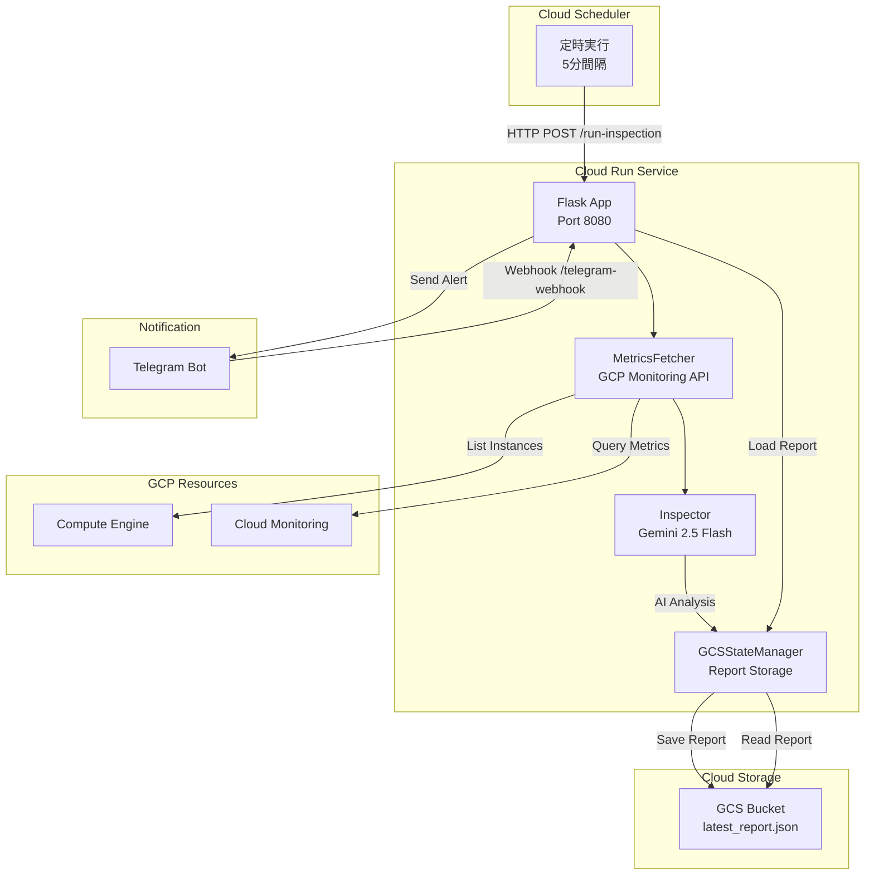

# GCP Monitoring Agent

<p align="center">
  
  
  
  
</p>

## 📋 プロジェクト概要

**GCP Monitoring Agent** は、Cloud Run 上にデプロイされるインテリジェントな GCP リソース監査システムです。定期的に GCE インスタンスのメトリクスを収集し、Gemini 2.5 Flash AI を用いて分析を行い、Telegram Bot 経由でアラートを通知します。

### 主な機能

- 🤖 **AI 駆動型分析** - Gemini 2.5 Flash を使用したモニタリングメトリクスのインテリジェント分析
- 📊 **自動メトリクス収集** - GCP Monitoring API に基づく確実なデータ収集
- 💬 **Telegram 連携** - Bot とのインタラクション対応 (`/status`, `/inspect` コマンド)
- ☁️ **Cloud Run デプロイ** - サーバーレスアーキテクチャによる従量課金制
- 📁 **状態の永続化** - 監査レポートを GCS に保存
- 🔧 **柔軟な設定** - YAML 設定ファイルと環境変数の両方に対応

---

## 🏗️ アーキテクチャ



### コンポーネント説明

| コンポーネント | 説明 | 技術 |
|------|------|------|
| **MetricsFetcher** | GCE インスタンスの CPU/ディスク/ステータスメトリクスを収集 | `google-cloud-monitoring`, `google-cloud-compute` |
| **Inspector** | Gemini AI でメトリクスを分析しステータスを判定 | `vertexai`, Gemini 2.5 Flash |
| **GCSStateManager** | 監査レポートの保存・読み込み | `google-cloud-storage` |
| **TelegramHandler** | Bot へのメッセージ送信およびインタラクション処理 | Telegram Bot API |
| **Orchestrator** | 監査フローのオーケストレーション | Python クラス |

---

## 🚀 クイックスタート

### 前提条件

- Python 3.13+
- GCP プロジェクトおよび必要な API の有効化
- Telegram Bot Token
- GCS バケット

### ローカル開発

```bash
# 1. リポジトリをクローン
git clone https://github.com/Winson-030/2026-monitor-agent.git
cd gcp-monitoring-agent

# 2. 仮想環境を作成
python -m venv venv
source venv/bin/activate  # Linux/Mac
# Windows の場合: venv\Scripts\activate

# 3. 依存関係をインストール
pip install -r requirements.txt

# 4. 環境変数を設定
cp .env.example .env
# .env を編集して設定を入力

# 5. 実行
python main.py
```

### API エンドポイント

| エンドポイント | メソッド | 説明 |
|----------|--------|-------------|
| `/run-inspection` | POST | 監査ジョブを実行 |
| `/telegram-webhook` | POST | Telegram Webhook |
| `/healthz` | GET | ヘルスチェック |

---

## 📦 Cloud Run へのデプロイ

### 1. 必要な API を有効化

```bash
gcloud services enable run.googleapis.com
gcloud services enable monitoring.googleapis.com
gcloud services enable compute.googleapis.com
gcloud services enable storage.googleapis.com
gcloud services enable aiplatform.googleapis.com
gcloud services enable cloudbuild.googleapis.com
```

### 2. ビルドとデプロイ

```bash
# イメージをビルド
gcloud builds submit --tag gcr.io/$PROJECT_ID/gcp-monitor

# Cloud Run にデプロイ
gcloud run deploy gcp-monitor \
  --image gcr.io/$PROJECT_ID/gcp-monitor \
  --region us-central1 \
  --platform managed \
  --allow-unauthenticated \
  --set-env-vars="TELEGRAM_BOT_TOKEN=your-bot-token" \
  --set-env-vars="TELEGRAM_CHAT_ID=your-chat-id"
```

詳細なデプロイ手順は [DEPLOYMENT_jp.md](DEPLOYMENT_jp.md) を参照してください。

---

## ⚙️ 設定

### config.yaml

```yaml
gcp:
  project_id: "your-project-id"      # GCP プロジェクト ID
  region: "us-central1"              # デフォルトリージョン
  default_zone: "us-central1-a"      # デフォルトゾーン

thresholds:
  cpu_critical: 90                   # CPU クリティカルしきい値 (%)
  cpu_warning: 80                    # CPU 警告しきい値 (%)
  disk_critical: 90                  # ディスククリティカルしきい値 (%)
  disk_warning: 80                   # ディスク警告しきい値 (%)

gcs_bucket: "your-bucket-name"       # GCS バケット名

budget:
  daily_max_usd: 3.0                 # 1日あたりの予算上限 (USD)

inspection:
  zones:                             # 監査対象ゾーン
    - "us-central1-a"
    - "us-central1-b"
```

### 環境変数

| 変数 | 必須 | 説明 |
|----------|----------|-------------|
| `TELEGRAM_BOT_TOKEN` | ✅ | Telegram Bot Token (@BotFather から取得) |
| `TELEGRAM_CHAT_ID` | ✅ | Telegram チャット ID |
| `GOOGLE_CLOUD_PROJECT` | - | GCP プロジェクト ID |
| `GOOGLE_APPLICATION_CREDENTIALS` | - | サービスアカウントキーのパス（ローカル開発用） |

詳細な設定情報は [CONFIGURATION_jp.md](CONFIGURATION_jp.md) を参照してください。

---

## 💬 Telegram Bot コマンド

| コマンド | 説明 |
|---------|-------------|
| `/status` | 最新の監査レポートを表示 |
| `/inspect <インスタンス>` | 特定インスタンスの詳細分析を表示 |
| 任意のテキスト | 最新のレポートに基づくスマート Q&A |

---

## 📁 プロジェクト構造

```
gcp-monitoring-agent/
├── agents/                 # AI 分析モジュール
│   ├── __init__.py
│   ├── inspector.py       # Gemini アナライザー
│   └── prompts.py         # システムプロンプト
├── fetcher/               # データ収集モジュール
│   ├── __init__.py
│   └── metrics.py         # GCP メトリクス取得
├── notify/                # 通知モジュール
│   ├── __init__.py
│   └── telegram.py        # Telegram Bot
├── store/                 # ストレージモジュール
│   ├── __init__.py
│   └── state_manager.py   # GCS 状態管理
├── main.py                # Flask アプリケーションエントリポイント
├── orchestrator.py        # 監査オーケストレーション
├── config.yaml            # 設定ファイル
├── requirements.txt       # Python 依存関係
├── Dockerfile             # コンテナイメージ
└── .env.example           # 環境変数サンプル
```

---

## 🤝 コントリビューション

あらゆる形の貢献を歓迎します！

1. このリポジトリを **Fork** してください
2. **Feature Branch** を作成してください (`git checkout -b feature/AmazingFeature`)
3. 変更を **Commit** してください (`git commit -m 'Add some AmazingFeature'`)
4. Branch に **Push** してください (`git push origin feature/AmazingFeature`)
5. **Pull Request** を作成してください

---

## 📄 ライセンス

このプロジェクトは [MIT License](LICENSE) の下でライセンスされています。

---

## 📚 ドキュメント

- [中文文档 (Chinese)](README_cn.md)
- [English Documentation](README_en.md)
- [デプロイガイド (Japanese)](DEPLOYMENT_jp.md)
- [設定ガイド (Japanese)](CONFIGURATION_jp.md)

---

<p align="center">
  Made with ❤️ by <a href="https://github.com/Winson-030">Winson</a>
</p>
